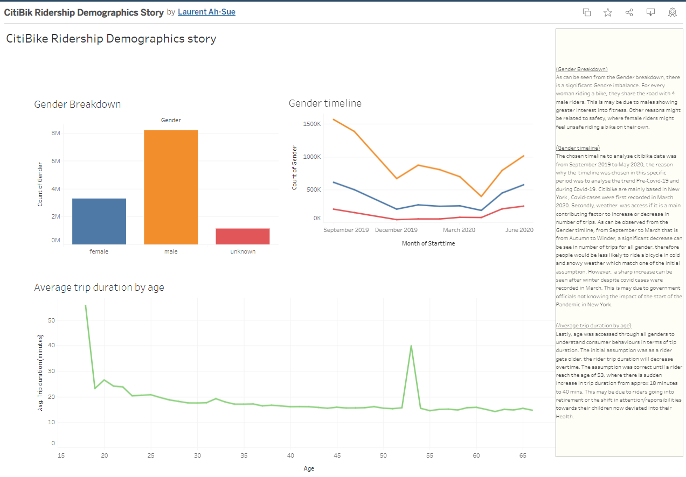

# Tableau-challenge

**Purpose and Motivation**

The aim of this challenge is to analyse interesting trends from New York CitiBike open source dataset.

The chosen period to analyse the data was from September 2019 to May 2020, I wanted to know how the pandemic or season affected CitiBike the usage of customers/subscribers. The datasource on their website [Citi Bike Data](https://wwww.citibikenyc.com/system-data).

**Questions**

* What were the count of trips of customers and subscribers before Covid-19 and during Covid-19?
* What were the count of trip of customers and subscribers during autumn and winter?
* What is the CitiBike ridership gender demographics?
* How age of customers and subscribers is linked to trip duration?
* Which Bike station is the most populor for riders to start their journey in New York?
* Which Bike station is the most popular for riders to end their journey in New York?
* Which Bikes are the most used?

**Visualization**

A story was created to understand the the gender imblance in the New York Citi Bike dataset in the link below.

(https://public.tableau.com/app/profile/laurent.ah.sue/viz/CitiBikRidershipDemographicsStory/CitiBikeRidershipDemographicsstory)

**CitiBike Ridership Demographic Dashboard**

A dashboard was created to enable user to view how ridership is varied in terms of age and gender in the linnk below.

(https://public.tableau.com/app/profile/laurent.ah.sue/viz/CitiBikRidershipDemographicsDashboard/RidershipDemographics)

(images/CitiBike Ridership Demographic Dashboard.PNG)

**CitiBike Demand and Maintenance Dashboard**

A dashboard was created to enable user to view how which bikes are mostly used per bikeID and which are the most population station for riders to start and end their journey which can be found in the link below.

(https://public.tableau.com/app/profile/laurent.ah.sue/viz/CitiBikDemandMaintenanceDashboard/DemandMaintenanceDashboard)

(images/CitiBike Demand and Maintenance Dashboard.PNG)

**CitiBike Official City Map**

This map enables the user to view which Bike Station records the lowest trips or highest trips. The user can filter through the number of trips and time-period. It can be observed that riders are more likely to start and end their journey in central New York, one of the main reasons is because of heavy traffic in central New York where people are likely to ride bikes to not get stuck in traffic. The other reason is due to demographic, the map layer represents the age per zip code, and it can be observed that younger people such as young professionals would rather reside in the inner city due to work being in closer proximity.  The map layer can be seen below.

(https://public.tableau.com/app/profile/laurent.ah.sue/viz/CitiBikOfficialCityMap/CityOfficialMap)

(images/CitiBike Official City Map.PNG)

